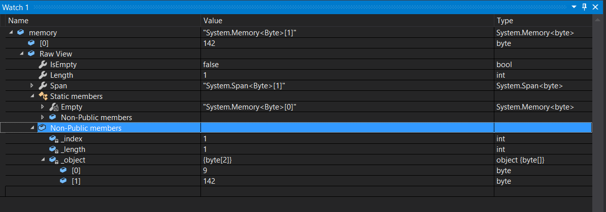

# Playing with Memory<T> and usage

With .NET Core 2.1 the type Memory<T> appeared. The question is: how to use it and what can be the advantage?

## The Memory<T> type

You can find more information on this new class in the .NET Core docs [here](https://github.com/dotnet/corefxlab/blob/master/docs/specs/memory.md). What will follow is more about showing how to use it, the advantages and what to take care of when using Memory. In short, Memory provide a pointer on an array of data. Directly on the raw storage.

In the example, I'm using a ```Memory<byte>``` type. So we will point on array of bytes. The application a simple console application.

## Creating the Memory<T> type

Something quite surprising is that when you'll create a Memory type, an initialization with ```= null;``` is enough. In reality when you'll do that, you'll initialize the object itself, not the data on where it's pointing. Here is a bit of code to illustrate that:

```C#
// Initialize the memory type as null
Memory<byte> memory = null; // = new Memory<byte>();
// In normal world, this would throw an error but in fact, the null initialization will initialize the class
if (memory.IsEmpty)
    Console.WriteLine($"Memory is empty");
else
{
    DisplayData(memory);
}
```

As a result, you won't raise an exception when calling the ```memory.IsEmpty``` property but you'll get ```True``` so the message will be displayed in the console.

You can create as well the Memory type directly from a byte array like in the following code:

```C#
// Initialization of 2 bytes
var twobytes = new byte[2] { 0, 3 };
// Initialization of the 2 bytes in a Memory type
memory = new Memory<byte>(twobytes);
```

Or you can copy part of an Array in a Memory class:

```C#
// Now initialize the Memory with a partial part of the bytes
memory = new Memory<byte>(twobytes, 1, 1);
```

## Modifying data in a Memory class and on the original bytes

In order to display data from the Memory byte array and from the byte array, we're creating 2 simple functions to display the content of the arrays:

```C#
static private void DisplayData(Memory<byte> memory)
{
    Console.Write($"Memory: ");
    for (int i = 0; i < memory.Length; i++)
        Console.Write($"{memory.Span[i]} ");
    Console.WriteLine();
}

static private void DisplayBytes(byte[] memory)
{
    Console.Write($"Bytes: ");
    for (int i = 0; i < memory.Length; i++)
        Console.Write($"{memory[i]} ");
    Console.WriteLine();
}
```

Now let's play a bit with the data. First, let's change the data from the Memory object and see the result on the initial data.

```C#
// Initialization of 2 bytes
var twobytes = new byte[2] { 0, 3 };
// Initialization of the 2 bytes in a Memory type
memory = new Memory<byte>(twobytes);
memory.Span[0] = 42;
DisplayData(memory);
DisplayBytes(twobytes);
// Setting it to null
memory = null;
// The twobytes still exist and has not been destroyed
DisplayBytes(twobytes);
// No bytes will be displayed
DisplayData(memory);
if (memory.Span.IsEmpty)
    Console.WriteLine($"Memory is empty");
```

The result looks like:

```
Memory: 0 3
Memory: 42 3
Bytes: 42 3
Bytes: 42 3
Memory:
Memory is empty
```

So in short, changing the data thru the Memory object thru ```memory.Span[0] = 42```, changes as well the data in the root byte array.

Now, interesting to note as well that setting ```memory = null``` is not destroying the original data, it is just releasing the memory object. So you can continue to use the original array.

Let's continue to play a bit and test this time changing the data from the original array:

```C#
memory = twobytes;
DisplayData(memory);
twobytes[0] = 5;
DisplayData(memory);
memory.Span[0] = 9;
DisplayBytes(twobytes);
```

Now the output is:

```
Memory: 42 3
Memory: 5 3
Bytes: 9 3
```

So changing the original array byte is changing the data in the Memory object. In fact, all this is totally normal. Memory objects are just pointers on the core data of your core object. 

Now, we will initialize the Memory class with a partial part of the initial array, then release the data from the array and see the result:

```C#
// Now initialize the Memory with a partial part of the bytes
memory = new Memory<byte>(twobytes, 1, 1);
DisplayData(memory);
DisplayBytes(twobytes);
memory.Span[0] = 12;
DisplayData(memory);
DisplayBytes(twobytes);
// Releasing the byte array
twobytes = null;
// Are the data still here?
if (memory.IsEmpty)
    Console.WriteLine($"Memory is empty");
else
{
    DisplayData(memory);
}
memory.Span[0] = 142;
DisplayData(memory);
if (twobytes == null)
{
    Console.WriteLine("The byte array is null");
}
else
{
    DisplayBytes(twobytes);
}
```

And as a result we will get:

```
Memory: 3
Bytes: 9 3
Memory: 12
Bytes: 9 12
Memory: 12
Memory: 142
The byte array is null
```

When only having a partial view of the initial array, the expected behavior is still working, changing a data on the Memory will change the data on the initial array.

Where it starts to be very interesting, is that when we are setting your initial array to null, the data are still present into the Memory object. And it is still possible to change those data! And even after forcing the garbage collector to operate:

```C#
GC.Collect();
DisplayData(memory);
```

The output is still 142 as expected ```Memory: 142```. Now, let's put a breakpoint here and check how the memory object looks like:



When looking at the members, you can find the different information like the length which is 1 as we've only put 1 byte in it from the previously 2 bytes array. Where it is interesting is to look at the non public members, here, you can see that the object is a 2 bytes objects and is the original objects that we pointed on. The memory object is just tracking the index on where to point and how long. So this show us that one more time the Memory object is just a pointer on the initial array. So if you have a huge array, that you point on few bytes, then setup the huge array to null, you won't deallocate the object from the memory, even after calling the garbage collector.

## Playing with unsafe

Hey, now we fully understand how all this is working, let's have more fun :-) Let's play directly with unsafe and let's make changes directly on the pointer side.

You can get the pointe on the data by doing ```var dt = memory.Pin()``` and then in an unsafe code ```var pt = dt.Pointer```.

To be able to use unsafe code, we'll need to explicitly add it to the project property or use the /unsafe parametter un the dotnet command line. If you are using a Visual Studio project, then add ```<AllowUnsafeBlocks>true</AllowUnsafeBlocks>``` in the .csproj in the ```PropertyGroup``` section. If you are using VS Code, you can add in the .json project file ```"compilationOptions": { "allowUnsafe": true }```.

Same as for the previous example, we can try to modify some of the data. This time directly on the pointer in the unsafe section.

```C#
memory = new byte[4] { 0, 2, 4, 6 };
DisplayData(memory);
var dt = memory.Pin();

unsafe
{
    // Here, we get the pointer
    var pointer = (byte*)dt.Pointer;
    *pointer = 24;
    // Let's see what we have in this memory
    Console.Write("Pointer: ");
    for (int i = 0; i < memory.Length; i++)
    {
        Console.Write($"{*pointer} ");
        pointer++;
    }
    Console.WriteLine();
}
DisplayData(memory);
```

The output looks like that:

```
Memory: 0 2 4 6
Pointer: 24 2 4 6
Memory: 24 2 4 6
```

So as expected, when you modify directly the memory, you modify the value.

You can as well allocate memory in an unsafe section. I do not recommend that as then the garbage collector won't work. And if it is not working, if you don't manage correctly the deallocation of the memory, you may quickly result into an application consuming a lot of memory.

More documentation on how to use [unsafe](https://docs.microsoft.com/en-us/dotnet/csharp/language-reference/language-specification/unsafe-code) in the official documentation.

## Best usage and recommendations to use Memory<T>

As you've seen in the previous part, the Memory class is great to point directly on the data of an object and keep the data even after setting the initial object to null. But this is as well where you have to be very attentive.

* Recommendation 1: use carefully the Memory object, mainly if you need to have a readable code partially pointing on a large buffer and you want to manipulate part of it with a direct pointer on the data. You'll avoid copying data in array. This is the main usage and it will allow you to gain a lot in performance.
* Recommendation 2: keep track of your objects, as you've seen, you may get rid of an object but you'll still have data in the Memory class. So be careful and make sure you clean all memory objects in a proper way. Risk is to have some memory usage increase and at some point the Garbage Collector may take a huge amount of time to clean the memory. A mechanism to avoid memory leak has been put in place.
* Recommendation 3: in a multithread environment, be careful on data modification.

All up, you can use them, it's perfect for partial view on large buffer, changing very fast data without having to copy data from one array to another.

